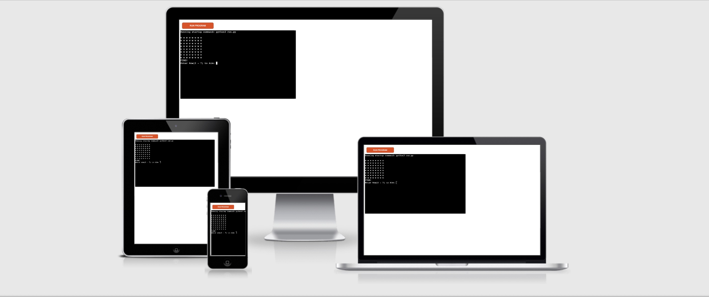

PP3-python-essentials README.md file

For this project I elected to take the option of Project Example Idea 2: A Battleship console game.

Features
Heading
Nav
Gallery/ Media?
Download pattern?
SignUp
Testing
Method/approach
system
manual?
sources
validation
[https://contrastchecker.com/] - Hero image and overlaying text check

[https://validator.w3.org/#validate_by_input]- HTML

[https://jigsaw.w3.org/css-validator/]- CSS

[https://developers.google.com/web/tools/lighthouse] - accessibility(crucial!)

Bugs
Finding bugs
common bugs
resolution of bugs
unresolved bugs
Solved Bugs
sources
Deployment
GitHub Pages: outline process
Credits
Borrowed Code - under licence
Content
Media
About
First milestone project of FullStack Software Development Diploma- ECommerce

## Reminders

* Your code must be placed in the `run.py` file
* Your dependencies must be placed in the `requirements.txt` file
* Do not edit any of the other files or your code may not deploy properly

## Creating the Heroku app

When you create the app, you will need to add two buildpacks from the _Settings_ tab. The ordering is as follows:

1. `heroku/python`
2. `heroku/nodejs`

You must then create a _Config Var_ called `PORT`. Set this to `8000`

If you have credentials, such as in the Love Sandwiches project, you must create another _Config Var_ called `CREDS` and paste the JSON into the value field.

Connect your GitHub repository and deploy as normal.

## Constraints

The deployment terminal is set to 80 columns by 24 rows. That means that each line of text needs to be 80 characters or less otherwise it will be wrapped onto a second line.

-----
Happy coding!